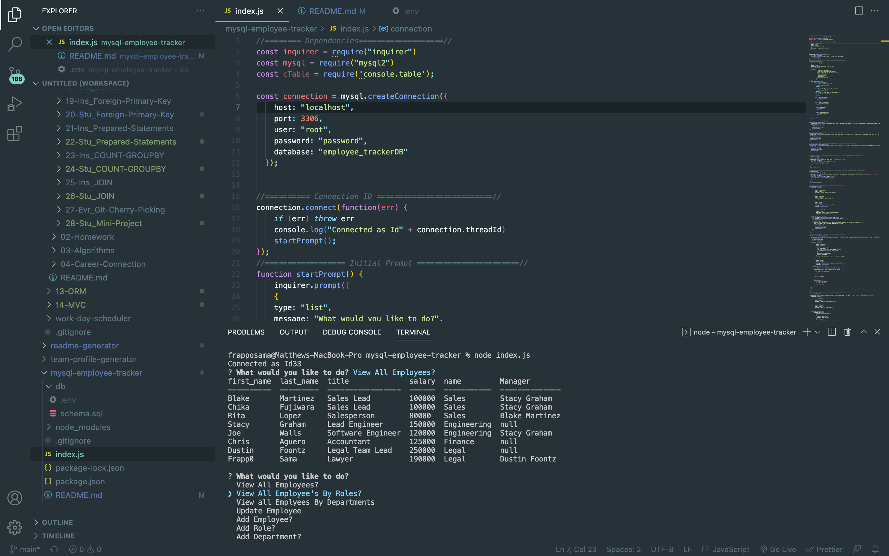

# mysql employee tracker

  

## Description

MySQL-Employee-Tracker is an interface command program that make it easy for non-developers to view and interact with information stored in databases. This interface is a good example of a Content Management Systems; a command line application for managing a company's employees using node, inquirer, and MySQL.

## Installation

node, inquirer, mysql

## Usage

Application tree structure: The application is user friendly and built to handle large amount of data (ie: what if the company have about 10,000 employees and 1,000+ roles)

## License

## Screenshots

## Links

https://youtu.be/yBztAvfBoGM

## Contributing

Matthew Gonzales

## Username

@mattyjtx

## Email

mattgonzales3@yahoo.com